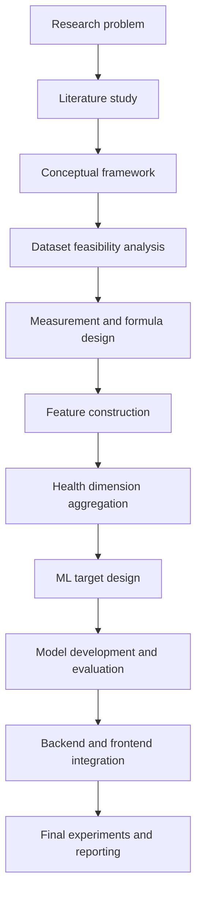
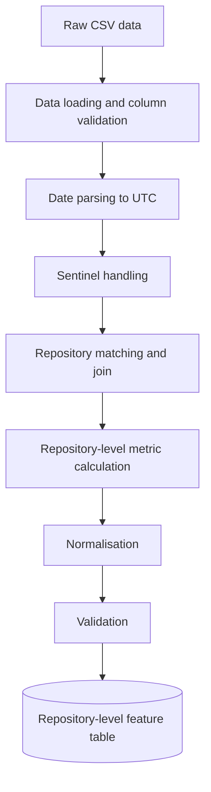
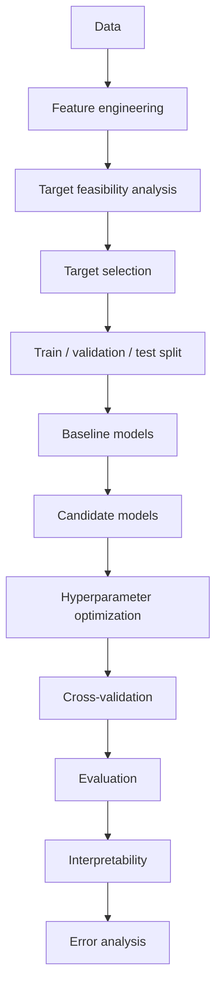
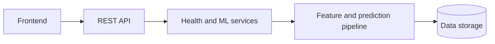
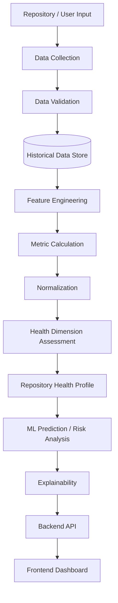
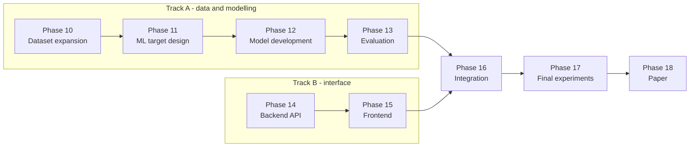

# Repository Intelligence Platform

**A Research-Oriented Framework for Multi-Dimensional Open Source Repository Health Assessment and Intelligent Analysis**

Major Project · Batch CSM-B2 · Research-oriented category

---

## Table of Contents

| # | Section | | # | Section |
|---|---|---|---|---|
| 1 | [Problem Statement](#1-problem-statement) | | 10 | [Missingness and Uncertainty](#10-handling-missingness-and-uncertainty) |
| 2 | [Research Objective](#2-research-objective) | | 11 | [Repository Health Profile](#11-repository-health-profile) |
| 3 | [Research Foundation](#3-research-foundation) | | 12 | [Machine Learning Plan](#12-machine-learning-plan) |
| 4 | [Five-Dimension Framework](#4-proposed-five-dimension-health-framework) | | 13 | [Evaluation Plan](#13-evaluation-plan) |
| 5 | [Methodology](#5-methodology) | | 14 | [Backend Plan](#14-backend-plan) |
| 6 | [Data Strategy](#6-data-strategy) | | 15 | [Frontend Plan](#15-frontend-plan) |
| 7 | [Metric Design Approach](#7-metric-design-approach) | | 16 | [System Architecture](#16-end-to-end-system-architecture) |
| 8 | [Feature Construction](#8-feature-construction-approach) | | 17 | [Implementation Plan](#17-implementation-plan) |
| 9 | [Health Aggregation](#9-health-dimension-aggregation-approach) | | 18 | [Expected Outcome](#20-expected-outcome) |

---

## 1. Problem Statement

Open-source repositories emit a large number of signals — commits, pull requests, issues,
contributors, reviews, releases, activity patterns and community engagement. Before adopting an
open-source component, developers and organisations need to answer a practical question:

> *Is this repository healthy enough to depend on?*

In practice this is usually answered with a single number — stars, forks, or commit count. That is
inadequate. **Repository health is multidimensional.** A project can be extremely popular and poorly
maintained; it can be quietly maintained and almost unknown; it can appear active while its
contributor base has collapsed to a single person. A single popularity figure cannot separate these
cases, and treating popularity as health conflates *attention* with *viability*.

Existing platforms such as GitHub Insights, OpenSSF Scorecard and Libraries.io provide repository
statistics, security assessments or partial health indicators, but none offers a unified framework
combining repository health analysis, sustainability assessment, contributor intelligence,
documentation evaluation, risk analysis and adoption recommendations.

### What this project builds

A **Repository Intelligence Platform** that will:

1. collect repository-level and event-level data,
2. construct measurable indicators from that data,
3. organise those indicators into five health dimensions,
4. explicitly handle missingness, applicability, sampling limitations and statistical uncertainty,
5. produce a transparent **Repository Health Profile**,
6. investigate ML-based prediction using a scientifically defensible target,
7. and expose results through a backend API and a frontend dashboard.

---

## 2. Research Objective

> To develop a **reproducible and traceable framework** for assessing the health of open-source
> software repositories across multiple dimensions, rather than relying on a single popularity
> metric.

The framework is built on literature-derived constructs, with project-specific contributions
identified explicitly wherever the work goes beyond what the literature provides.

---

## 3. Research Foundation

### 3.1 Base paper

| | |
|---|---|
| **Title** | *Assessing Open Source Software Health in Organizations' Intake Processes: A Qualitative Study on the Practitioners' Perspective* |
| **Authors** | Johan Linåker, Thomas Olsson, Efi Papatheocharous |
| **Venue** | Empirical Software Engineering (Springer), 2026, 31:105 |
| **DOI** | `10.1007/s10664-026-10846-y` |
| **Role** | Provides the conceptual health taxonomy — **5 areas → 21 health aspects → 72 metrics (M1–M72)** |

The base paper is a qualitative interview survey of 17 industry experts, mapped against the CHAOSS
and OpenSSF Scorecard frameworks and validated in a case study at a large automotive manufacturer.

> **Methodological consequence.** The base paper supplies metric *names and prose definitions* — it
> contains no mathematical formulas, thresholds, units or weights. Every formula used in this
> project must therefore be adopted from a supporting paper, derived from a base-paper construct
> definition, or proposed by us. No formula may be attributed to the base paper.

### 3.2 Supporting literature

| Ref | Paper | Role |
|---|---|---|
| **S1** | He, Ye, Zhou — *Repository Centrality in Lifespan Prediction of OSS Projects* | Deprecation definition; the argument that point-in-time features are weaker than temporal ones |
| **S2** | Alami, Pardo, Linåker (2024), EMSE 29:114 — *FOSS Communities Sustainability* | Executable formulas for efficiency, growth and community age |
| **S3** | Tamburri, Palomba, Serebrenik, Zaidman (2019) — *YOSHI / Community Patterns* | Community-structure constructs |
| **S4** | Kaushik, Chahal — *Community Engagement and OSS Lifespan* | Per-month lifespan normalisation; PR acceptance and issue resolution rates; documented skew failure modes |
| **S5** | Xiao, He, Xu, Zhang, Zhou (ESEC/FSE 2023) — *Early Participation & Sustained Activity* | Target-definition template for the ML component |

### 3.3 Metric provenance classification

Every metric carries a provenance class. This distinction is central to the research contribution.

| Class | Meaning |
|:---:|---|
| **A** | Formula **adopted verbatim** from a research paper |
| **B** | Formula **derived** from a paper's construct definition — the paper gives the concept, we give the equation |
| **C** | **Our proposed contribution** — no source specifies it |

---

## 4. Proposed Five-Dimension Health Framework

| Dimension | Purpose | Example indicators |
|---|---|---|
| **D1** Development & Maintenance Health | Is the project actively worked on, and is that activity growing or declining? | Commit frequency; review throughput; development trend |
| **D2** Contributor / Community Health | Who maintains it, how concentrated is that knowledge, is the contributor base growing? | Bus factor; newcomer rate; retention; contributor diversity |
| **D3** Issue & Pull Request Health | Are contributions accepted and problems resolved, and how quickly? | PR acceptance rate; resolution latency; issue closure rate; backlog |
| **D4** Community Engagement / Popularity | How much external attention and adoption does the project have? | Stars; forks; growth over time |
| **D5** Sustainability / Maintenance Risk | Is the project at risk of abandonment or unsupported dependency? | Deprecation status; licence; activity recency; funding signals |

A dimension is scored only where the underlying data genuinely supports it. Where a dimension's
inputs are unavailable, it is reported as **Not Assessed** rather than approximated from unrelated
columns.

---

## 5. Methodology

The project follows a strict ordering: **the data is assessed before any metric is designed, and
every metric is designed before any model is trained.**



### Governing principle

> **No metric is implemented unless the required underlying data actually exists.**

Where a metric's inputs are only partly available, it is left unimplemented rather than silently
degenerating into a different measurement.

### Evidence classification

All research documentation tags every claim:

| Tag | Meaning |
|---|---|
| **[FACT]** | Directly observed in the data or a paper |
| **[DERIVED]** | Computed by our analysis; the computation is stated |
| **[REC]** | Our recommendation — a judgement call |
| **[ASSUME]** | An assumption, stated so it can be challenged |

---

## 6. Data Strategy

The project uses a two-stage data strategy.

### Stage 1 — Prototype dataset

A public Kaggle dataset of GitHub repository, issue and pull-request records is used to build and
validate the measurement pipeline end to end. Its purpose is to prove the methodology, not to
produce final research results.

| File | Contents |
|---|---|
| `repo_data.csv` | Repository snapshot — one row per repository |
| `issues_data.csv` | Issue events with timestamps |
| `pr_data.csv` | Pull-request events with timestamps |

This dataset is deliberately small. It cannot support all five dimensions, and the feasibility
analysis records exactly which dimensions it does and does not support.

### Stage 2 — Final research dataset

Richer longitudinal GitHub data will be collected, prioritising:

| # | Data | Unblocks |
|---:|---|---|
| 1 | Repository metadata — licence, README, CI config, topics | D5; documentation and governance aspects |
| 2 | **Commit history** with timestamps | D1 properly |
| 3 | **Contributor / author identities** | **D2 entirely**; bus factor; retention |
| 4 | Issue history | D3 depth |
| 5 | Pull-request history, uncapped | Comparable cross-repository aggregates |
| 6 | **Pull-request reviews** | Review depth; time-to-first-review |
| 7 | **Comments** with timestamps and authors | Response-time metrics |
| 8 | Merge and close timestamps | Resolution efficiency |
| 9 | Releases and tags | Release cadence and rhythm |
| 10 | **Stars and forks over time** | D4 growth metrics |
| 11 | Labels | Bug ratio; triage rate |
| 12 | Repository activity history | Trend validity |
| 13 | **Archived / deprecated status** | D5 ground truth |
| 14 | Sufficient historical coverage | Trend and survival analysis |

> **Historical watcher counts are not obtainable** from the GitHub API — only a current snapshot is
> available. Metrics requiring watcher history are therefore out of scope by construction.

#### Target size — completeness over count

**Target: 300–500 repositories with complete history**, rather than the largest number obtainable.
Incomplete collection is what limits snapshot datasets; a larger sample carrying the same defect
would not improve anything. 300–500 complete repositories is sufficient for the planned modelling
and achievable within the project timeline.

#### Sampling design — fixed before collection begins

**This single decision determines whether D5 becomes measurable.** A sample drawn by popularity
contains only survivors, leaving no negative class to learn from or validate against. The sample is
therefore stratified deliberately:

| Stratum | Purpose | How to find it |
|---|---|---|
| Active, well-maintained | Positive examples | Standard search |
| **Archived / deprecated** | **Negative examples — required for D5** | GitHub search `archived:true` |
| Dormant but not archived | Boundary cases | Low recent activity, not archived |
| Small and mid-sized | Avoids popularity-only bias | Star-range strata, not top-N |

> **The sampling frame is fixed before the collector is written.** Changing it afterwards means
> collecting everything a second time.

#### Collection feasibility

Data collection is the critical path and is planned as an engineering task in its own right.

| Constraint | Consequence | Mitigation |
|---|---|---|
| GitHub API rate limit — 5,000 authenticated requests/hour | Full history for hundreds of repositories takes weeks, not days | Budget the request count before starting; prefer GraphQL batching over per-item REST calls |
| Long runs fail partway | A crash mid-collection loses everything | **Checkpoint after every repository** — resumable by design, writing incrementally to disk |
| Historical events are expensive to crawl | Reconstructing years of activity dominates the cost | Use **GH Archive** — the public GitHub event stream since 2011, queryable via BigQuery — for historical events, and the API only for current metadata |

The collection design actively avoids **survivorship bias**, **popularity-only selection**,
**single-snapshot analysis**, **excessive sampling caps**, **mixing incompatible repository
workflows**, and **target leakage**.

---

## 7. Metric Design Approach

Formulas are not invented to fill missing metrics. Each metric is specified with:

definition · equation · input columns · unit · aggregation level · interpretation · direction ·
assumptions · edge cases · limitations · provenance class · source citation.

### Avoiding leakage and circular metrics

Popularity variables must not be used to predict one another. Forks and watchers are measured in the
same snapshot as stars and are produced by the same user behaviour — they proxy the target rather
than predict it. Accordingly:

- popularity is treated as a **descriptive** variable, excluded from dimension scores and from ML
  feature sets;
- a **leakage register** is maintained for every candidate ML target, listing the columns that must
  be dropped.

### Normalisation approach

Metrics are mapped onto a common `[0, 1]` health scale, direction-aligned so that higher always
means healthier.

| Metric type | Treatment |
|---|---|
| Bounded ratios | Used directly — they already carry absolute meaning |
| Durations | Saturating transform `1 / (1 + x / x_ref)` with a **fixed** reference |
| Counts | Rate-normalised by observed lifespan, then bounded |

**Min-max normalisation is rejected.** With a small sample, `min` and `max` are estimated from the
sample itself, so adding one repository changes every other repository's score — which breaks the
repository comparison the platform exists to perform. Fixed-reference transforms are
sample-independent.

Reference constants are treated as **provisional** and require calibration on a large external
corpus before any published claim.

---

## 8. Feature Construction Approach



Requirements the pipeline satisfies:

- **No record is silently dropped.** Anything excluded is counted and reported.
- **Sentinel values are explicitly handled** and never allowed to contaminate calculations. A
  sentinel such as `-1` marking "not closed" is a flag, not a duration; treating it as one would
  corrupt every average.
- **Events are aggregated to their parent repository** — pull requests and issues are never treated
  as independent units.
- **Output is deterministic** — no sampling, no random state, no wall-clock dependence, so
  consecutive runs are byte-identical.
- **Validation is independent** — verification scripts recompute values from the raw data without
  importing the modules they verify, so agreement means two implementations of the same equation
  agree rather than merely that the code ran.

---

## 9. Health Dimension Aggregation Approach

### Block aggregation

Where a dimension draws on two distinct constructs, its metrics are grouped into blocks and the
blocks weighted explicitly, rather than averaging all members flatly:

```
PR block     = mean(PR-side metrics)
Issue block  = mean(issue-side metrics)

D3           = 0.5 x PR block + 0.5 x Issue block
```

A flat mean over all members would assign weights by accident — whichever construct happened to
contribute more metrics would dominate — and would double-count correlated members. Block weighting
makes the balance an explicit design choice.

### Weighting

The base paper supplies no weights and argues that weighting is context-dependent, identifying four
project traits that moderate interpretation: life-cycle stage, complexity, governance concentration
and strategic importance. Data-driven weighting requires a far larger sample than a prototype
provides.

**Equal weighting within a block is therefore adopted as our proposal** — the maximum-entropy choice
under ignorance, introducing no unjustified preference. It is not claimed to be optimal, and is
revisited once the final dataset supports factor analysis.

---

## 10. Handling Missingness and Uncertainty

### Distinct states, never collapsed

| State | Meaning |
|---|---|
| **Genuine zero** | A real measurement that happens to be `0.0` — it is scored |
| **No data** | The underlying events do not exist — excluded, reason recorded |
| **Not applicable** | The measurement source is inappropriate for this repository — excluded, reason recorded |
| **Insufficient precision** | The estimate is too uncertain to contribute — excluded from the score, raw value preserved |
| **Capture limitation** | The collected sample is too truncated to be comparable — excluded, reason recorded |

> **Missing metrics are never converted to zero.** Zero is a measurement; missing is not.

### Workflow applicability

Platform activity does not necessarily represent a project's actual development workflow. Some
projects host code on GitHub but review it elsewhere — on mailing lists, in internal systems, or
through separate bug trackers. For those projects, pull-request metrics measure automation rather
than maintainer behaviour.

The applicability mechanism therefore:

1. bases the decision on an **externally verifiable, cited** fact — the project's own contribution
   documentation — never on a threshold fitted to our data;
2. uses activity statistics only as a **screening aid** that flags candidates for human
   verification;
3. **deletes no repository** — affected metrics become Not Assessed with a recorded reason.

> **"Not Assessed" does not mean "unhealthy".** It means the available activity is not an
> appropriate measurement source for that metric under this methodology.

### Precision-aware suppression

A minimum record count is not a sufficient reliability test: a metric can have many observations and
still be highly uncertain, while a small but tightly clustered sample can be very reliable.
Dispersion drives reliability, not count.

The approach is therefore to:

- compute a **bootstrap confidence interval** for each estimate;
- **preserve the raw metric** regardless;
- **suppress from aggregation** any estimate whose interval is too wide to distinguish the score
  from its opposite;
- record the reason for every suppression.

Any suppression threshold is labelled a **provisional methodological choice**, not a
literature-derived constant.

---

## 11. Repository Health Profile

The output is a **Repository Health Profile**, not a single validated index:

```
Repository Health Profile
├── D1  Development & Maintenance     score, where supported
├── D2  Contributor / Community       score, where supported
├── D3  Issue & Pull Request          score, where supported
├── D4  Community Engagement          score or descriptive value
└── D5  Sustainability / Risk         score, where supported
```

Each profile carries **coverage** — how much of the framework could actually be assessed — and
**warnings** explaining every gap in plain language.

### Why not a single Repository Health Index

A composite index is defensible only once the following hold:

1. a sample large enough to support a train/validate split;
2. all constituent dimensions measurable;
3. validated ground-truth health labels to test the index against;
4. workflow differences accounted for;
5. sampling and capture limitations resolved;
6. transformation constants calibrated rather than provisional;
7. sufficient longitudinal coverage.

Until those conditions are met, a candidate composite may be computed for experimentation but is
labelled **PROVISIONAL** and is never presented as a validated health index.

---

## 12. Machine Learning Plan



### Candidate model families

Linear and regularized regression · Logistic regression · Random Forest · Gradient Boosting ·
XGBoost · others where justified.

**The final model is selected experimentally.** No claim is made in advance about which will perform
best.

### Requirements the target must satisfy

| # | Requirement |
|---:|---|
| 1 | Meaningful relationship to repository health |
| 2 | Sufficient observations for a credible split |
| 3 | No leakage from target-derived features |
| 4 | Reproducible label construction |
| 5 | Clear, pre-specified evaluation methodology |
| 6 | Research traceability to the literature |

### Constraints on target selection

- **Popularity counts are not chosen by default.** Popularity co-signals leak, and popularity is not
  health.
- **A pull-request-level outcome is not treated as repository health** unless a defensible
  relationship between the two is established. Conflating an event-level outcome with a
  repository-level construct would be a category error.
- **The health profile is not used as its own training label.** Predicting a construct from the
  features that built it is circular.

Candidate targets grounded in the literature include sustained-activity definitions (S5) and
deprecation status (S1). **Target design is a distinct research step**, carried out and documented
before any model is trained.

---

## 13. Evaluation Plan

### Experiments

| # | Experiment | Purpose |
|---:|---|---|
| 1 | Metric validity | Distributions, missingness, stability, sensitivity |
| 2 | Health profile validity | Dimension distributions, correlations, robustness to aggregation choice |
| 3 | ML baseline | Simple baselines established *before* complex models |
| 4 | Model comparison | Multiple algorithms under identical splits |
| 5 | Hyperparameter optimization | Only after baseline comparison |
| 6 | Cross-validation | Grouped and temporal CV — no random leakage between periods or repositories |
| 7 | Feature importance / explainability | Attribution and interpretability methods |
| 8 | Ablation study | Remove feature groups and dimensions; measure the change |
| 9 | Sensitivity analysis | Provisional constants: reference values, scales, aggregation weights |
| 10 | Error analysis | Investigate systematically mispredicted repositories |

### Metrics

| Target type | Metrics |
|---|---|
| **Regression** | MAE, RMSE, R², Spearman correlation where ranking is meaningful |
| **Classification** | Precision, Recall, F1, ROC-AUC, PR-AUC where appropriate, confusion matrix; accuracy only where class balance permits |

Always reported alongside: baseline performance · cross-validation performance · confidence
intervals where feasible · error distribution · model stability.

---

## 14. Backend Plan



Responsibilities: repository lookup · data retrieval · feature computation · health profile
generation · prediction · metric explanation · model information · result history.

The API contract is defined by the **shape** of the health profile — its fields and status values —
so backend development does not need to wait for the final dataset.

---

## 15. Frontend Plan

| # | Screen | Purpose |
|---:|---|---|
| 1 | Dashboard | Entry point and summary |
| 2 | Repository search / input | Select a repository to analyse |
| 3 | Repository overview | Identity, age, size, context |
| 4 | Health profile | The five dimensions at a glance |
| 5 | Dimension-wise scores | Drill-down per dimension |
| 6 | Metric explanations | What each metric means and where it came from |
| 7 | Historical trends | Activity over time |
| 8 | Risk / warning indicators | Sustainability and maintenance concerns |
| 9 | ML prediction | Model output |
| 10 | Model explanation | Why the model produced that output |
| 11 | Repository comparison | Side-by-side evaluation |
| 12 | Data-quality / coverage indicators | How much could actually be assessed |

> **The interface must not hide uncertainty.** *"Not Assessed"* must be visually unmistakable from
> *"Poor Health"* — never rendered as a zero, never as an empty bar that reads as a low score.

---

## 16. End-to-End System Architecture



---

## 17. Implementation Plan

### Phase 1 — Research Problem
- **Objective:** Define the decision-support problem and its scope.
- **Tasks:** Problem articulation; scope boundaries; success criteria.
- **Deliverable:** Problem statement and project scope.
- **Validation:** Scope reviewed against the base paper's stated research gap.

### Phase 2 — Literature Study
- **Objective:** Identify base and supporting literature; extract constructs and formulas.
- **Tasks:** Read the base paper and supporting papers directly; extract metric definitions; identify which papers supply executable formulas and which supply constructs only.
- **Deliverable:** Literature synthesis with per-metric source attribution.
- **Validation:** Every citation traceable to a locatable place in the source.

### Phase 3 — Conceptual Framework
- **Objective:** Define the health dimensions and their relationships.
- **Tasks:** Dimension definitions; research questions; traceability to base-paper aspects.
- **Deliverable:** Health assessment framework document.
- **Validation:** Reproduction of existing work explicitly separated from our extension.

### Phase 4 — Dataset Feasibility
- **Objective:** Determine what the available data can legitimately measure.
- **Tasks:** Structure inspection; missingness and duplicate analysis; join-key identification; temporal coverage; dimension mapping; metric feasibility; target feasibility.
- **Deliverable:** Dataset feasibility report.
- **Validation:** Every claim tagged as fact, derivation, recommendation or assumption; every unsupported metric recorded with the exact missing column.

### Phase 5 — Measurement & Formula Design
- **Objective:** Define exact formulas with provenance.
- **Tasks:** Metric selection; formula specification; normalisation design; aggregation design; leakage register.
- **Deliverable:** Measurement and formula design document.
- **Validation:** Every formula assigned a provenance class and verified computable on real data.

### Phase 6 — Feature Construction
- **Objective:** Implement the specified formulas as reproducible code.
- **Tasks:** Data loading and validation; metric functions; normalisation; pipeline orchestration; automated tests.
- **Deliverable:** Feature-construction pipeline and repository-level feature table.
- **Validation:** Automated tests; independent recomputation from raw data; byte-identical repeated runs.

### Phase 7 — Feature Inspection
- **Objective:** Assess metric distributions and identify methodological problems.
- **Tasks:** Distribution analysis; outlier and skew assessment; investigation of any metric behaving implausibly.
- **Deliverable:** Feature inspection report.
- **Validation:** Findings quantified with measured evidence rather than assertion.

### Phase 8 — Health Dimension Aggregation
- **Objective:** Aggregate metrics into dimensions with explicit handling of gaps.
- **Tasks:** Workflow applicability rule; precision gating; block aggregation; minimum-member rules.
- **Deliverable:** Health aggregation module and repository health profiles.
- **Validation:** Every gap carries a recorded reason; no dimension silently zero-filled.

### Phase 9 — Health Profile Validation
- **Objective:** Confirm the profile methodology is defensible and freeze it for the prototype.
- **Tasks:** Coverage analysis; distribution checks; metric-dominance analysis; scientific-validity review.
- **Deliverable:** Validation findings and a frozen methodology.
- **Validation:** Reproducibility confirmed; every limitation documented.

### Phase 10 — Final Dataset Expansion · *critical path*
- **Objective:** Collect longitudinal data covering all five dimensions.
- **Tasks:** Fix the stratified sampling frame first; build a resumable, checkpointing collector; collect contributor identities, commit history, reviews, comments and star/fork history; validate completeness per repository.
- **Target:** 300–500 repositories with complete history, including archived and dormant projects.
- **Deliverable:** Final research dataset.
- **Validation:** D2 and D5 inputs present; negative class present; no pagination caps; per-repository completeness recorded.
- **Risk:** This phase can consume the whole schedule. It is time-boxed, and Track B below runs in parallel.

### Phase 11 — ML Target Design
- **Objective:** Select a scientifically defensible prediction target.
- **Tasks:** Candidate enumeration; leakage analysis; label construction; argument linking the target to the health construct.
- **Deliverable:** ML target design document.
- **Validation:** All six target requirements satisfied and documented.

### Phase 12 — ML Model Development
- **Objective:** Build baseline and candidate models.
- **Tasks:** Baselines; candidate algorithms; hyperparameter optimization.
- **Deliverable:** Trained models and training code.
- **Validation:** Baselines established before complex models; no leakage; grouped or temporal splits.

### Phase 13 — Model Evaluation
- **Objective:** Evaluate honestly against baselines.
- **Tasks:** Cross-validation; metric reporting; stability analysis; error analysis.
- **Deliverable:** Evaluation report.
- **Validation:** Metrics appropriate to the target type; results reported with baselines and uncertainty.

### Phase 14 — Backend Development · *Track B*
- **Objective:** Serve the health profile over a REST API.
- **Tasks:** Define the response contract from the health profile schema; endpoints for lookup, profile retrieval and metric explanation.
- **Deliverable:** Backend service.
- **Validation:** "Not Assessed" and descriptive states survive serialisation as distinct states, never as `0`.

### Phase 15 — Frontend Development · *Track B*
- **Objective:** Visualise the health profile.
- **Tasks:** Dashboard; repository view; dimension display; coverage and warning indicators.
- **Deliverable:** Frontend application.
- **Validation:** "Not Assessed" visually unmistakable from a low score.

### Phase 16 — End-to-End Integration
- **Objective:** Join the data and modelling track to the interface track.
- **Tasks:** Replace fixture data with the final dataset; wire in predictions and explanations.
- **Deliverable:** Integrated system.
- **Validation:** No interface change required when the dataset is swapped — if one is required, the Phase 14 contract was wrong.

### Phase 17 — Final Experiments & Research Evaluation
- **Objective:** Run the full experimental programme.
- **Tasks:** Experiments 1–10 as specified in the evaluation plan.
- **Deliverable:** Experimental results and analysis.
- **Validation:** Every provisional constant subjected to sensitivity analysis.

### Phase 18 — Documentation, Paper & Presentation
- **Objective:** Report the work.
- **Tasks:** Research paper; final documentation; presentation.
- **Deliverable:** Paper and presentation materials.
- **Validation:** Every claim traceable to a documented experiment.

### Two parallel tracks

Phases 14–16 do not depend on Phases 10–13. Running them in series is the main scheduling risk: the
interface work is what a reviewer sees first and is the most likely to be squeezed if data
collection overruns.



Track B builds against the health profile schema as a fixed contract. Only Phase 16 requires both
tracks.

---

## 18. Planned Repository Structure

```
Repository-Intelligence-Platform/
│
├── docs/
│   ├── research/          # framework, feasibility, measurement design
│   └── implementation/    # pipeline and aggregation documentation
│
├── src/rip/               # analytical pipeline
│   ├── config.py          # constants and thresholds
│   ├── provenance.py      # metric registry with research lineage
│   ├── loading.py         # load, validate, parse
│   ├── metrics.py         # one function per specified formula
│   ├── normalization.py   # health-score transforms
│   ├── applicability.py   # workflow applicability rules
│   ├── precision.py       # confidence intervals and suppression
│   ├── health.py          # dimension aggregation and profile
│   ├── validation.py      # validation checks
│   └── pipeline.py        # orchestration
│
├── scripts/               # entry points and verification scripts
├── tests/                 # automated tests
├── results/               # generated feature tables and profiles
├── data/raw/              # raw datasets (not committed)
│
├── README.md
├── LICENSE
└── .gitignore
```

---

## 19. Research Principles

These govern every decision in the project:

1. **Never invent missing data.**
2. **Never convert "Not Assessed" into zero.**
3. **Never claim a metric is literature-derived when it is our own.**
4. **Avoid target leakage.**
5. **Separate popularity from health.**
6. **Account for repository workflow differences.**
7. **Preserve uncertainty** — report confidence, do not hide it.
8. **Validate formulas independently** — a second implementation, not a rerun.
9. **Prefer reproducibility over impressive numbers.**
10. **Do not claim the system is validated until experiments demonstrate it.**

### Reproducibility requirements

| Requirement | Approach |
|---|---|
| Fixed formulas | Specified in the design document; changes recorded in an amendment log, never overwritten |
| Documented provenance | Every metric carries source, class and citation |
| Deterministic processing | No sampling, no wall-clock dependence; seeded where randomness is required |
| Automated tests | Unit tests for every metric function and aggregation rule |
| Independent verification | Verification scripts do not import the modules they verify |
| Explicit assumptions | Provisional constants listed and labelled |
| Version control | All code and documentation tracked in Git |
| Data separation | Raw data excluded from version control; generated results kept separate from source |

---

## 20. Expected Outcome

A research-backed Repository Intelligence Platform capable of:

- accepting and identifying repositories,
- collecting relevant repository history,
- calculating transparent, traceable health indicators,
- generating a multidimensional health profile,
- explicitly identifying missing and uncertain dimensions rather than hiding them,
- estimating relevant future outcomes and risk using an experimentally validated ML model,
- explaining its predictions,
- visualising repository health,
- comparing repositories,
- and supporting reproducible research experiments.

Success will be evaluated through the effectiveness of the health assessment, repository comparison
accuracy, the quality of the health profile, and the usefulness of the generated recommendations.

---

## Project Team

| Reg. No. | Name |
|---|---|
| 23BQ1A4297 | Donthiboyina Rajeswari |
| 23BQ1A4299 | Mangamuri Varun Kumar |
| 23BQ1A42B9 | Naidu Manikanta Sai |
| 23BQ1A4287 | Konakanchi Hemanth Kumar |

**Project Guide:** Dr. K. Gnanendra
**Department:** CSE (AI) · Batch CSM-B2

---

## License

See [LICENSE](LICENSE).
