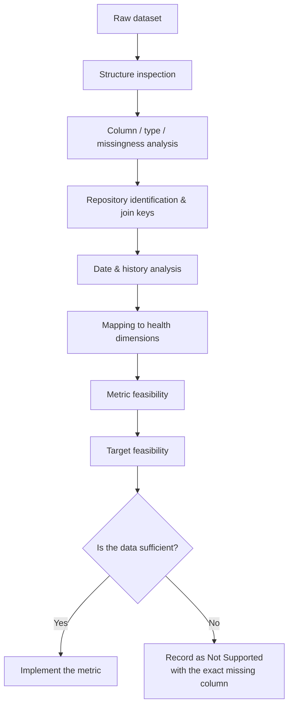
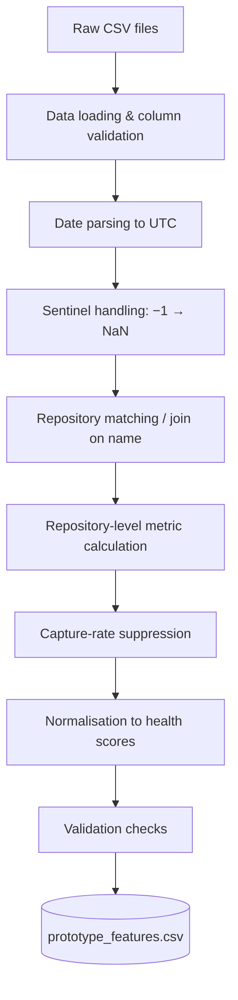
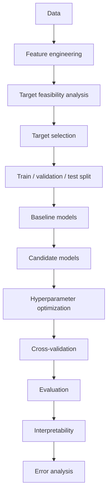
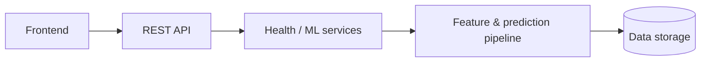
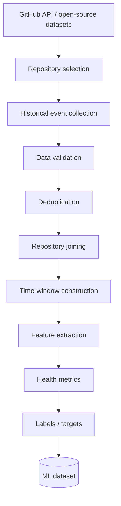
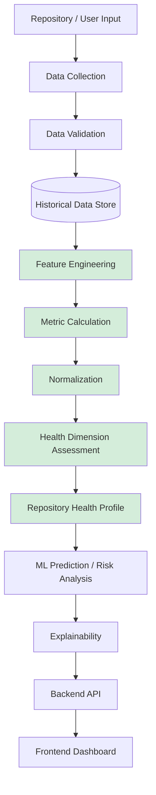
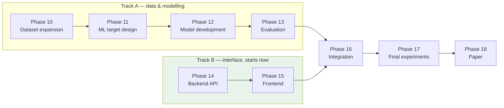

# AI-Assisted Developer Decision Support and Repository Intelligence Platform

**A Research-Oriented Framework for Multi-Dimensional Open Source Repository Health Assessment and Intelligent Analysis**

Major Project · Batch CSM-B2 · Research-oriented category

## Table of Contents

| # | Section | | # | Section |
|---|---|---|---|---|
| 1 | [Project Overview](#1-project-overview) | | 11 | [Precision and Uncertainty](#11-precision-and-uncertainty) |
| 2 | [Research Objective](#2-research-objective) | | 12 | [Current Output](#12-current-output) |
| 3 | [Research Foundation](#3-research-foundation) | | 13 | [The RHI Decision](#13-the-rhi-decision) |
| 4 | [Five-Dimension Framework](#4-five-dimension-health-framework) | | 14 | [Machine Learning Plan](#14-machine-learning-plan) |
| 5 | [Dataset Strategy](#5-dataset-strategy) | | 15 | [Backend & Frontend Plan](#15-backend-plan) |
| 6 | [Dataset Feasibility](#6-dataset-feasibility) | | 16 | [End-to-End System](#17-end-to-end-final-system) |
| 7 | [Measurement & Formula Design](#7-measurement-and-formula-design) | | 17 | [Research Contribution](#18-proposed-research-contribution) |
| 8 | [Feature Construction](#8-feature-construction-pipeline) | | 18 | [Limitations](#19-limitations) |
| 9 | [Health Aggregation](#9-health-dimension-aggregation) | | 19 | [Roadmap](#20-implementation-roadmap) |
| 10 | [Workflow Applicability](#10-workflow-applicability) | | 20 | [How to Run](#23-how-to-run-the-current-prototype) |

---

## 1. Project Overview

### The problem

Open-source repositories emit a large number of signals — commits, pull requests, issues,
contributors, reviews, releases, activity patterns and community engagement. Developers,
organisations and researchers routinely need to answer a practical question before adopting a
project:

> *Is this repository healthy enough to depend on?*

In practice this question is usually answered with a single number — stars, forks, or commit count.
That is inadequate. **Repository health is multidimensional.** A project can be extremely popular
and poorly maintained; it can be quietly maintained and almost unknown; it can look active while
its contributor base has collapsed to one person. A single popularity figure cannot separate these
cases, and treating popularity as health conflates *attention* with *viability*.

### What this project builds

A **Repository Intelligence Platform** that:

1. collects repository-level and event-level data,
2. constructs measurable indicators from that data,
3. organises indicators into five health dimensions,
4. explicitly handles missingness, applicability, sampling limitations and statistical uncertainty,
5. produces a transparent **Repository Health Profile**,
6. later investigates ML-based prediction using a scientifically defensible target,
7. and finally exposes results through a backend API and a frontend dashboard.

---

## 2. Research Objective

> To develop a **reproducible and traceable framework** for assessing the health of open-source
> software repositories across multiple dimensions, rather than relying on a single popularity metric.

The five planned dimensions are:

| | Dimension |
|---|---|
| **D1** | Development & Maintenance Health |
| **D2** | Contributor / Community Health |
| **D3** | Issue & Pull Request Health |
| **D4** | Community Engagement / Popularity |
| **D5** | Sustainability / Maintenance Risk |

---

## 3. Research Foundation

### 3.1 Base paper

| | |
|---|---|
| **Title** | *Assessing Open Source Software Health in Organizations' Intake Processes: A Qualitative Study on the Practitioners' Perspective* |
| **Authors** | Johan Linåker, Thomas Olsson, Efi Papatheocharous |
| **Venue** | Empirical Software Engineering (Springer), 2026, 31:105 |
| **DOI** | `10.1007/s10664-026-10846-y` |
| **Role** | Provides the conceptual health taxonomy — **5 areas → 21 health aspects → 72 metrics (M1–M72)** |

The base paper is a **qualitative interview survey** of 17 industry experts, mapped against the
CHAOSS and OpenSSF Scorecard frameworks and validated in a case study at a large automotive
manufacturer.

> **Important methodological consequence.** The base paper supplies metric *names and prose
> definitions* — it contains **no mathematical formulas, thresholds, units or weights**. Every
> formula in this project is therefore either adopted from a supporting paper, derived from a
> base-paper construct definition, or our own proposal. No formula may be attributed to the base
> paper. This is recorded in
> [`measurement-and-formula-design.md`](docs/research/measurement-and-formula-design.md) §1.1.1.

### 3.2 Supporting literature

| Ref | Paper | Role in this project |
|---|---|---|
| **S1** | He, Ye, Zhou — *Repository Centrality in Lifespan Prediction of OSS Projects* | Deprecation definition; argument that point-in-time features are weaker than temporal ones |
| **S2** | Alami, Pardo, Linåker (2024), EMSE 29:114 — *FOSS Communities Sustainability* | **The only source with executable formulas** (Table 4): TEC-2, STA-1, STA-4 adopted verbatim |
| **S3** | Tamburri, Palomba, Serebrenik, Zaidman (2019) — *YOSHI / Community Patterns* | Community-structure constructs; not implementable on this dataset |
| **S4** | Kaushik, Chahal — *Community Engagement and OSS Lifespan* | Per-month lifespan normalisation; names PRAR and IRR; documents skew failure modes |
| **S5** | Xiao, He, Xu, Zhang, Zhou (ESEC/FSE 2023) — *Early Participation & Sustained Activity* | Target-definition template for future ML work |

> **Base-paper attribution.** The base paper is the one named in the project registration form
> (`CSM_B2_ABSTRACT.pdf`, page 2) — Linåker et al. All supporting papers listed above were read
> directly; nothing in this project is attributed to a source that was not available to read.

### 3.3 Three levels of metric provenance

Every implemented metric carries a provenance class. This distinction is central to the research
contribution and is enforced in code (`src/rip/provenance.py`).

| Class | Meaning | Count |
|:---:|---|:---:|
| **A** | Formula **adopted verbatim** from a research paper | 3 |
| **B** | Formula **derived** from a paper's construct definition (paper gives the concept, we give the equation) | 4 |
| **C** | **Our proposed contribution** — no source specifies it | 5 |

---

## 4. Five-Dimension Health Framework

| Dimension | Purpose | Example indicators | Current prototype status |
|---|---|---|---|
| **D1** Development & Maintenance Health | Is the project actively worked on, and is that activity growing or declining? | Review throughput; relative development trend | 🔄 **Weakly measurable** — 2 metrics, no commit data available |
| **D2** Contributor / Community Health | Who maintains it, how concentrated is that knowledge, is the contributor base growing? | Bus factor; newcomer rate; retention | ⬜ **Not assessable** — the dataset has **no author/contributor identity field** |
| **D3** Issue & Pull Request Health | Are contributions accepted and problems resolved, and how quickly? | PR acceptance rate; resolution latency; issue closure rate | ✅ **Measurable** for applicable repositories |
| **D4** Community Engagement / Popularity | How much external attention and adoption does the project have? | Stars; forks; watchers | 🔄 **Descriptive only** — single snapshot, no time series, no watchers column |
| **D5** Sustainability / Maintenance Risk | Is the project at risk of abandonment or unsupported dependency? | Deprecation status; bus factor; licence; funding | ⬜ **Not assessable** — required longitudinal/risk data absent |

**Why D2 and D5 are marked Not Assessable.** The dataset contains no author column, no commit
history, no licence field, and its archived/deprecated flag is constant across all rows. Rather than
approximating these dimensions from unrelated columns, they are reported as **Not Assessed**.

> These are **dataset limitations, not permanent limitations of the proposed platform.** The final
> data collection plan ([§16](#16-final-data-collection-plan)) is designed specifically to unblock D2 and D5.

---

## 5. Dataset Strategy

### Stage 1 — Small prototype dataset ✅ *in use*

A public Kaggle dataset comprising three CSV files:

| File | Rows | Columns | Distinct repositories | Role |
|---|---:|---:|---:|---|
| `repo_data.csv` | **28** | 20 | 28 | Repository snapshot (one row per repository) |
| `issues_data.csv` | **7,082** | 11 | 22 | Issue events |
| `pr_data.csv` | **248,320** | 12 | 27 | Pull-request events |

*Source: [`dataset-feasibility-report.md`](docs/research/dataset-feasibility-report.md) §1.1.*

This dataset was selected to **build and validate the pipeline**, not to produce final research
results. Key findings from the feasibility analysis:

- `repo_data.csv` is **snapshot data** — no history, one observation per repository.
- `issues_data.csv` and `pr_data.csv` are genuine **event-level history** with timestamps.
- The dataset **cannot support all five dimensions**.
- **9 repositories have PR collection capped** at approximately 1,000 rows by API pagination; for
  several, the entire captured history falls inside a single recent year.
- Some repositories have **workflow differences** — GitHub pull requests are not their actual
  review mechanism (see [§10](#10-workflow-applicability)).
- ⚠️ The columns named `issue_contributors`, `pr_contributors` and `total_contributors`
  **do not count contributors** — they count *distinct issue/PR titles*, verified exactly on
  28 of 28 repositories. They are excluded from all analysis.
- There is **no valid basis for fabricating missing metrics**.

### Stage 2 — Final research dataset ⬜ *planned, not collected*

Richer longitudinal GitHub data, prioritising:

| # | Data | Unblocks |
|---:|---|---|
| 1 | Repository metadata (licence, README, CI config, topics) | D5; documentation/governance aspects |
| 2 | **Commit history** with timestamps | D1 properly; base-paper M10 Code Activity |
| 3 | **Contributor / author identities** | **D2 entirely**; bus factor; retention |
| 4 | Issue history | D3 depth |
| 5 | PR history (uncapped) | Comparable cross-repository aggregates |
| 6 | **PR reviews** | Review depth; time-to-first-review |
| 7 | **Comments** with timestamps and authors | Response time (S2 COM-1 exactly) |
| 8 | Merge / close timestamps | Already available; retained |
| 9 | **Releases and tags** | Release cadence and rhythm |
| 10 | **Stars and forks over time** | D4 growth metrics |
| 10b | Watchers — *current count only* | ⚠️ **Historical watcher counts are not obtainable** from the GitHub API. S2's POP-1 (`\|F\|+\|S\|+\|W\|`) therefore stays permanently unreproducible; only a snapshot term is available. |
| 11 | **Labels** | Bug ratio; triage rate |
| 12 | Repository activity history | Trend validity |
| 13 | **Archived / deprecated status** | D5 ground truth (S1's definition) |
| 14 | Sufficient historical coverage | Trend and survival analysis |

### Target size — completeness over count

**Target: 300–500 repositories with complete history**, not the largest number obtainable.

Incompleteness is precisely what limits the current dataset — nine of its 28 repositories are
truncated by an API pagination cap, which makes their aggregates non-comparable. A larger sample
with the same defect would not fix anything. 300–500 complete repositories is sufficient for the
planned modelling and is achievable inside the project timeline.

### Sampling design — decided before collection begins

**This is the single decision that determines whether D5 becomes measurable.**

The current sample consists entirely of large, actively maintained flagship projects, so there is
**no negative class** to learn from or validate against. If the final sample is drawn by popularity
again, the same wall is hit and the collection has to be repeated.

The sample must therefore be **stratified deliberately**:

| Stratum | Purpose | How to find it |
|---|---|---|
| Active, well-maintained | Positive examples | Standard search |
| **Archived / deprecated** | **Negative examples — required for D5** | GitHub search `archived:true` |
| Dormant but not archived | Boundary cases | Low recent activity, not archived |
| Small and mid-sized | Avoids popularity-only bias | Star-range strata, not top-N |

> 🔴 **Fix the sampling frame before writing the collector.** Changing it afterwards means
> collecting everything a second time.

> ⬜ This richer dataset **has not been collected**. Statements about it describe intent.

---

## 6. Dataset Feasibility

A complete feasibility analysis was performed **before any model development**. This ordering is a
deliberate research principle, not a convenience.



### The governing principle

> **No metric is implemented unless the required underlying data actually exists.**

Where a metric's inputs are only partly available, it is left unimplemented rather than silently
degenerating into a different measurement. For example, S2's COM-2 formula is `|C| + |I|`
(comments + issues); with comment data unavailable, implementing it would reduce it to a plain issue
count under a published formula's name. It is therefore **not implemented**.

### Evidence classification

All research documents tag every claim:

| Tag | Meaning |
|---|---|
| **[FACT]** | Directly observed in the data or a paper. Reproducible. |
| **[DERIVED]** | Computed by our analysis; the computation is stated. |
| **[REC]** | Our recommendation — a judgement call. |
| **[ASSUME]** | An assumption, stated so it can be challenged. |

**Deliverable:** [`dataset-feasibility-report.md`](docs/research/dataset-feasibility-report.md) (995 lines).

---

## 7. Measurement and Formula Design

The project does **not** invent formulas to fill missing metrics. **12 metrics** are implemented,
each with recorded provenance.

### 7.1 Implemented metrics by provenance

#### Class A — adopted verbatim from a research paper

| ID | Metric | Formula | Source |
|---|---|---|---|
| **A2** | PR Resolution Efficiency | `Σ(end − created) / \|ended\|` | S2 Table 4, TEC-2 |
| **A8** | Development Activity Trend | `Σ(\|PR_{k+1}\| − \|PR_k\|)` over 12-week intervals | S2 Table 4, STA-4 |
| **C1** | Repository Age | `S − created_at` | S2 Table 4, STA-1 |

#### Class B — derived from a research definition

| ID | Metric | Formula | Source construct |
|---|---|---|---|
| **A1** | PR Acceptance Rate | `merged / (merged + closed)` | S4 (names PRAR); BP M42, M15 |
| **A5** | Issue Resolution Rate | `closed / total` | S4 (names IRR); BP M15 |
| **A6** | Issue Resolution Latency | `median(resolution_time_days ≠ −1)` | BP M5, M15 |
| **A7** | Review Throughput | `count(created_at ≥ S − w)`, `w ∈ {45, 90, 365}` | BP M11 construct; BP M10 + Table 3 windows |

#### Class C — our proposed contribution

| ID | Metric | Formula | Rationale |
|---|---|---|---|
| **A3** | PR Resolution Latency (median) | `median(end − created)` | A2's mean exceeds its median by up to 5,298× on this data |
| **A4** | PR Backlog Ratio | `open / total` | BP M14 defines backlog for issues; PR application is ours |
| **A8′** | Development Activity Slope | `OLS slope(k → \|PR_k\|)` | Addresses the telescoping property of S2's STA-4 |
| **C2** | PR Capture Rate | `rows / max(number)` | No source addresses API pagination truncation |
| **X1** | Popularity (partial) | `stars + forks` | **Not** S2's POP-1 (`\|F\|+\|S\|+\|W\|`) — no watchers column exists |

> Additionally, **A8R (Relative Development Trend)** is implemented and is the metric that actually
> feeds D1. See [§9.3](#93-a8r--relative-development-trend). It is a **Class C** contribution.

### 7.2 Each formula is documented with

definition · equation · input columns · unit · aggregation level · interpretation · direction ·
assumptions · edge cases · limitations · provenance class · source citation.

### 7.3 Leakage and circular metrics

Popularity variables must **not** be used to predict one another. `forks` and `watchers` are
measured in the same snapshot as `stars` and are produced by the same user behaviour — they proxy
the target rather than predict it. In earlier exploratory work on a different dataset, including
such co-signals inflated apparent R² by roughly 3×. Accordingly:

- **X1 (popularity) is display-only** — excluded from every dimension score and from all planned
  ML feature sets.
- A full **leakage register** is maintained per candidate target in
  [`measurement-and-formula-design.md`](docs/research/measurement-and-formula-design.md) §5.2.

**Deliverable:** [`measurement-and-formula-design.md`](docs/research/measurement-and-formula-design.md) (1,516 lines, including an Amendment Log).

---

## 8. Feature Construction Pipeline



### Verified properties

| Property | Value |
|---|---|
| Repositories processed | **28** |
| Issue records processed | **7,082** — 0 orphaned |
| PR records processed | **248,320** — 0 orphaned |
| Automated tests | **82 passing** (45 metric tests + 37 health tests) |
| Validation checks | **10 / 10 passing** |
| Independent sanity checks | **60 + 36 recomputations, 0 mismatches** |
| Reproducibility | **Byte-identical across consecutive runs** |

### Sentinel handling

The duration columns use `-1` to mean "not closed" / "not merged". This is a **sentinel, not a
duration**. It is converted to `NaN` at load time — **3,210 issue rows (45.3%)** and
**64,484 PR rows (26.0%)**. A regression test demonstrates that a leaked `-1` would corrupt the
median (1.5 instead of the correct 4.0), documenting why the load step matters.

### Independent validation

Sanity-check scripts **deliberately do not import the metric modules**. They re-read the raw CSVs
and recompute each value with inline arithmetic, so agreement means two independent implementations
of the same equation produced the same number — not that the code ran without error.

**Deliverable:** [`feature-construction.md`](docs/implementation/feature-construction.md).

---

## 9. Health Dimension Aggregation

### 9.1 D3 — nested block aggregation

```
PR block     = mean(A1, A3, A4)          over defined members
Issue block  = mean(A5, A6)              over defined members

D3           = 0.5 × PR block + 0.5 × Issue block      both blocks required
```

**Why blocks rather than a flat five-metric mean.** Two measured reasons:

1. A flat mean would silently assign the PR side 3/5 and the issue side 2/5 — an accident of how
   many metrics happened to survive on each side, not a decision.
2. It would double-count the issue signal: `A5` and `A6` correlate at **Spearman 0.648**, while the
   PR trio correlate 0.34–0.38 among themselves.

Block weighting makes the balance an **explicit 50/50 choice between two constructs**. This is
**our proposal** — the base paper supplies no weights and argues weighting is context-dependent.

### 9.2 D1 — both members required

```
D1 = mean(A7, A8R)          requires BOTH members
```

A one-metric D1 was previously emitted in a column indistinguishable from a two-metric D1. Requiring
both makes the score mean the same thing in every row where it appears.

### 9.3 A8R — relative development trend

```
A8R(r) = OLS_slope(k → |PR_k(r)|) / mean_k(|PR_k(r)|)
h(A8)  = 1 / (1 + exp(−A8R / 0.05))
```

**Why relative rather than absolute.** The absolute slope has units of *PRs per interval per
interval* and therefore scales with project size. Measured on this dataset: `grafana` declined
**9.9%** per interval and scored 0.065, while `cli` declined **14.2%** — a worse decline — and
scored 0.461, purely because `grafana` is roughly 24× larger. Dividing by mean interval volume
removes that confound.

> ⚠️ **The logistic scale `0.05` is a PROVISIONAL project choice, not a literature-derived
> constant.** No source paper specifies any logistic scale. It reads as *"a 5% change in PR volume
> per 12-week interval is one logistic unit"* — a falsifiable claim a reviewer can contest, unlike
> the unitless value it replaced. It requires calibration on a larger corpus.

### 9.4 Missingness — three states, never collapsed

| State | Representation | Example |
|---|---|---|
| **Genuine zero** | `0.0` — a real measurement | `hackingtool` A5 = 0.0 (0 of 19 issues closed) |
| **Not applicable** | `NaN` + `not_applicable_workflow` | `linux` A1 — project does not use GitHub PRs |
| **No data** | `NaN` + `no_data` | `kafka` A5 — zero issue rows exist |
| **Insufficient precision** | `NaN` in the score, **raw value preserved**, + `suppressed_imprecise` | `guava` A6 — CI covers 80% of the scale |
| **Capture limitation** | `NaN` + `suppressed_low_capture` | `ansible` — 1.2% of PR history present |

**Unavailable metrics are dropped from their block's mean — never treated as zero.** All 55 blanked
scores in the current output carry a specific, recorded reason; zero are unlabelled.

### 9.5 Coverage and warnings

`coverage` = dimensions scored ÷ 5. **The maximum attainable on this dataset is 0.4**, because D2
and D5 are unmeasurable and D4 is descriptive. Every profile row carries a `warnings` field
explaining each gap in plain language.

**Deliverable:** [`health-dimension-aggregation.md`](docs/implementation/health-dimension-aggregation.md).

---

## 10. Workflow Applicability

GitHub activity does not necessarily represent a project's actual development workflow. Four
repositories in the current dataset were identified as requiring special treatment:

| Repository | Actual review mechanism | Evidence (external, cited) |
|---|---|---|
| `linux` | Linux Kernel Mailing List (LKML) | `Documentation/process/submitting-patches.rst` |
| `git` | `git@vger.kernel.org` mailing list | `Documentation/SubmittingPatches` |
| `httpd` | `dev@httpd.apache.org` + Bugzilla | Apache HTTP Server contribution guide |
| `guava` | Google internal review, exported via Copybara | Guava `CONTRIBUTING.md` |

### What "Not Assessed" means — and does not mean

> **"Not Assessed" does NOT mean "unhealthy".**
>
> It means the available GitHub activity is **not an appropriate measurement source** for that
> metric under the current methodology. The Linux kernel is not an unhealthy project; our dataset
> simply cannot measure it, because its development does not happen through GitHub pull requests.

**Supporting evidence.** For `linux`, `git` and `httpd`, more than **98%** of the pull requests our
metrics would count never enter the code base at all (0.0%, 0.1% and 1.1% merge respectively). Every
applicable repository sits between **46.2% and 90.8%** — a complete separation with no overlap.

### Rules governing the mechanism

1. The decision rests on an **externally verifiable, cited** fact — the project's own contribution
   documentation — **never** on a threshold fitted to our data.
2. Latency statistics serve as a **screening aid only**. `flask` and `MiniCPM-V` reach 38% sub-hour
   PR disposition and are legitimately fast, so no defensible automatic cut point exists.
3. **No repository is deleted.** Affected metrics become Not Assessed with a recorded reason.

> 🔄 The applicability list is currently **hand-maintained and prototype-level**. Scaling to
> thousands of repositories will require an automated, validated workflow classifier — a planned
> item, not a solved one.

---

## 11. Precision and Uncertainty

### Why a minimum record count is not sufficient

| Repository | Closed issues | 95% CI width on the health scale |
|---|---:|---:|
| `flask` | **6** | **0.085** — one of the tightest estimates |
| `terraform` | **109** | **0.644** — one of the loosest |

**Sample size does not predict stability — dispersion does.** A minimum-n rule would suppress
`flask`, whose estimate is among the most reliable, while admitting `terraform`, whose estimate is
among the least. That is exactly backwards.

### The approach used instead

- A **percentile bootstrap confidence interval** is computed for each median-based metric
  (4,000 resamples, 95%).
- The **raw metric is always preserved** — only its eligibility for the dimension score changes.
- Highly imprecise metrics are **suppressed from aggregation**, with the reason recorded.
- **Suppression is not equivalent to zero.**

Seeds derive from `sha256(repository_name)` rather than a global seed, so results cannot depend on
iteration order and are identical on every machine.

> ⚠️ **The suppression threshold — a 95% CI covering more than half the health scale — is a
> PROVISIONAL methodological choice of ours.** It reads as *"an estimate that cannot be
> distinguished from its own opposite adds noise, not signal"*, but the value is not
> literature-derived.

---

## 12. Current Output

### `results/prototype_features.csv` — 28 rows × 67 columns

Repository-level measurable indicators: raw metric values, normalised health scores, context
variables, precision intervals, and a per-metric reason column for every gap.

### `results/health_profiles.csv` — 28 rows × 25 columns

The dimension-level Repository Health Profile.

| Dimension | Assessed | Notes |
|---|---:|---|
| **D1** Development & Maintenance | **18 / 28** | Where both members are available |
| **D2** Contributor / Community | **0 / 28** | `not_measurable` |
| **D3** Issue & Pull Request | **21 / 28** | Where both blocks are available |
| **D4** Engagement / Popularity | **0 scored** | `descriptive_only` — 28 values present, no score |
| **D5** Sustainability / Risk | **0 / 28** | `not_measurable` |

| Profile status | Count |
|---|---:|
| Both D1 and D3 scored | **16** |
| One dimension only | **7** |
| No meaningful health score | **5** |

### Supporting outputs

- `results/metric_summary.csv` — 33 rows: coverage, range and provenance per metric, including the
  21 metrics that **cannot** be implemented and why.
- `results/validation_report.txt` — dataset statistics, sentinel counts, the ten validation checks.

> ⚠️ **This output is NOT a validated Repository Health Index.** It is a transparent measurement
> profile with explicit gaps.

---

## 13. The RHI Decision

**We have deliberately not claimed a final Repository Health Index.**

An overall RHI is not currently scientifically defensible, for eight recorded reasons:

1. Only **28 repositories** are available — no train/validate split, no generalisation claim.
2. **Not all five dimensions are measurable** — any composite would cover 2 of 5.
3. **No validated ground-truth health labels exist** — the archived flag is constant, there is no
   commit data and no defect labels.
4. **Workflow differences** make PR metrics inapplicable for four repositories.
5. **Sampling and capture limitations** truncate nine repositories.
6. **Several transformation constants are provisional** and uncalibrated.
7. **Longitudinal information is insufficient** for trend validation.
8. Only **16 of 28** repositories carry both dimensions, so a composite would exist for 57% of the
   sample and be absent for the rest.

### What is produced instead

```
Repository Health Profile
├── D1  = <score>              where sufficiently supported
├── D2  = Not Assessed         no contributor identity data
├── D3  = <score>              where sufficiently supported
├── D4  = Descriptive          value reported, no score
└── D5  = Not Assessed         no longitudinal/risk data
```

A `candidate_rhi` column exists **for internal experimentation only**. Every row carries
`candidate_rhi_basis = "D1+D3 only (2 of 5 dimensions) - PROVISIONAL, not validated"`.

> 🔴 **The candidate RHI must never be presented as a validated result.**

---

## 14. Machine Learning Plan

> ⬜ **No model has been trained. No ML target has been selected. ML target design is the next
> major research decision.**

### Planned workflow



### Candidate model families

Linear / regularized regression · Logistic regression · Random Forest · Gradient Boosting ·
XGBoost · others only where justified.

**The final model will be selected experimentally.** No claim is made about which will perform best.

### Requirements the final target must satisfy

| # | Requirement |
|---:|---|
| 1 | Meaningful relationship to repository health |
| 2 | Sufficient observations for a credible split |
| 3 | No leakage from target-derived features |
| 4 | Reproducible label construction |
| 5 | Clear, pre-specified evaluation methodology |
| 6 | Research traceability to the literature |

### Explicit constraints

- ❌ **`stars_count` will not be chosen automatically.** With 28 repositories it cannot be a target
  at all, and popularity co-signals leak.
- ❌ **PR merge outcome will not be treated as repository health** unless a later methodology step
  establishes a defensible relationship. It is a *pull-request-level* outcome; the health profile is
  a *repository-level* construct. Conflating the two would be a category error.
- ⚠️ The health profile is a **descriptive artefact**, not a training label. With n = 28 it cannot
  train anything.

### Evaluation metrics — chosen after the target

| Target type | Metrics |
|---|---|
| **Regression** | MAE, RMSE, R², Spearman correlation where ranking is meaningful |
| **Classification** | Precision, Recall, F1, ROC-AUC, PR-AUC where appropriate, confusion matrix; accuracy **only** where class balance permits |

Always reported alongside: baseline performance · cross-validation performance · confidence
intervals where feasible · error distribution · model stability.

---

## 15. Backend Plan

> ⬜ **Planned. Not started.** The backend will be implemented **after** the analytical and ML
> pipelines are stable.



Responsibilities: repository lookup · data retrieval · feature computation · health profile
generation · prediction · metric explanation · model information · result history.

## 15b. Frontend Plan

> ⬜ **Planned. Not started.**

Planned screens: Dashboard · Repository search · Repository overview · Health profile ·
Dimension-wise scores · Metric explanations · Historical trends · Risk indicators · ML prediction ·
Model explanation · Repository comparison · Data-quality and coverage indicators.

> 🔴 **The UI must not hide uncertainty.** *"Not Assessed"* must be **visibly and unmistakably
> different** from *"Poor Health"*. A greyed-out or explicitly labelled state — never a zero, never
> an empty bar that reads as a low score.

---

## 16. Final Data Collection Plan

> ⬜ **Planned.**



The collection design must actively avoid: **survivorship bias** · **popularity-only selection** ·
**single-snapshot analysis** · **excessive sampling caps** · **mixing incompatible repository
workflows** · **target leakage**.

### Feasibility constraints — this phase is the critical path

Everything downstream blocks on data collection, so it must be planned as an engineering task in its
own right rather than as a single step.

| Constraint | Consequence | Mitigation |
|---|---|---|
| **GitHub API rate limit** — 5,000 authenticated requests/hour | Full history for hundreds of repositories runs to **weeks** of wall-clock time, not days | Budget the request count *before* starting; prefer GraphQL batching over per-item REST calls |
| **Long runs fail partway** | A crash on day 3 loses everything | **Checkpoint after every repository.** Resumable by design, writing incrementally to disk |
| **Historical events are expensive to crawl** | Reconstructing years of activity per repository dominates the cost | Consider **GH Archive** (public GitHub event stream since 2011, queryable via BigQuery) for historical events, using the API only for current metadata — far cheaper than crawling |
| **Watcher history does not exist** | S2 POP-1 cannot be reproduced regardless of effort | Accept the snapshot term; do not spend collection budget looking for it |

> ⏱️ **Time-box this phase.** The realistic failure mode for this project is not that the method is
> wrong — it is that data collection consumes the whole schedule and the later phases are rushed.
> See the parallel track in [§20](#20-implementation-roadmap).

---

## 17. End-to-End Final System



**Green = implemented in the current analytical prototype.** Everything else is planned.

---

## 18. Proposed Research Contribution

> Stated as **proposed contributions**. Novelty is not claimed as established until the literature
> review confirms it.

1. **Multi-dimensional repository health framework** — proposed integration of base-paper aspects
   into five decision-oriented dimensions.
2. **Traceable mapping** between literature constructs and computable repository metrics.
3. **Explicit metric provenance** (A / B / C) carried alongside every value in code and output.
4. **Missingness and workflow-applicability handling** — a documented, cited mechanism for
   recognising when platform activity does not represent a project's real workflow.
5. **Precision-aware aggregation** — bootstrap-based suppression instead of arbitrary sample-size
   thresholds.
6. **Repository Health Profile** rather than an unsupported single-score claim.
7. **ML-based prediction** after valid target construction — planned.
8. **Explainable repository-level intelligence** — planned.

---

## 19. Limitations

Current prototype limitations, stated plainly:

| Limitation | Detail |
|---|---|
| Small repository count | 28 repositories; only 16 with both dimensions scored |
| Incomplete dimensions | D2 and D5 unmeasurable; D4 descriptive |
| Limited historical coverage | `repo_data.csv` is a single snapshot |
| Sampling / capture limitations | 9 repositories capped at ~1,000 PRs |
| Workflow heterogeneity | 4 repositories require applicability gating |
| Missing contributor identity | No author column anywhere — blocks D2 entirely |
| Missing commit history | Blocks base-paper M10 Code Activity |
| Missing review / comment data | Blocks response-time and review-depth metrics |
| No validated health ground truth | Nothing to validate a health index against |
| Provisional normalization parameters | Reference constants frozen from this sample |
| Provisional aggregation decisions | 50/50 block weighting; equal weighting within blocks |
| No final ML target | Target design is the next research decision |
| **Metric dominance** | `A8R` correlates **+0.919** with D1 while `A7` correlates +0.384 — D1's ranking is effectively A8R's ranking, and inherits its provisional constant. `A4` is nearly inert in D3 (r = +0.218). |

**These limitations define the next research and data-collection stage.** They are documented, not
worked around.

---

## 20. Implementation Roadmap

### ✅ Phase 1 — Research Problem · COMPLETED
- **Objective:** Define the decision-support problem and scope.
- **Tasks:** Problem articulation; scope boundaries; success criteria.
- **Deliverable:** Project registration form; README problem statement.
- **Validation:** Scope reviewed against the base paper's stated research gap.

### ✅ Phase 2 — Literature Study · COMPLETED
- **Objective:** Identify base and supporting literature; extract constructs and formulas.
- **Tasks:** Read base paper (51 pp.) and S1–S5 directly; extract 72 metric definitions; identify which papers supply executable formulas.
- **Deliverable:** §1 of [`measurement-and-formula-design.md`](docs/research/measurement-and-formula-design.md).
- **Validation:** Every citation traced to a locatable place in the source; base-paper attribution corrected against the registration form.

### ✅ Phase 3 — Conceptual Framework · COMPLETED
- **Objective:** Define the health dimensions and their relationships.
- **Tasks:** Dimension definitions; research questions; base-paper traceability.
- **Deliverable:** [`health-assessment-framework.md`](docs/research/health-assessment-framework.md) (847 lines).
- **Validation:** Reproduction vs extension explicitly separated.

### ✅ Phase 4 — Dataset Feasibility · COMPLETED
- **Objective:** Determine what the available data can legitimately measure.
- **Tasks:** Structure, missingness, duplicates, join keys, temporal coverage, dimension mapping, target feasibility.
- **Deliverable:** [`dataset-feasibility-report.md`](docs/research/dataset-feasibility-report.md) (995 lines).
- **Validation:** Every claim tagged [FACT]/[DERIVED]/[REC]/[ASSUME]; the mislabelled contributor columns identified and excluded.

### ✅ Phase 5 — Measurement & Formula Design · COMPLETED
- **Objective:** Define exact formulas with provenance.
- **Tasks:** Metric selection; formula specification; normalisation design; aggregation design.
- **Deliverable:** [`measurement-and-formula-design.md`](docs/research/measurement-and-formula-design.md) (1,516 lines with Amendment Log).
- **Validation:** 3 Class A / 4 Class B / 5 Class C provenance assignment; formulas verified computable on real data.

### ✅ Phase 6 — Feature Construction · COMPLETED
- **Objective:** Implement the locked formulas as reproducible code.
- **Tasks:** Loading, validation, metric functions, normalisation, pipeline, tests.
- **Deliverable:** `src/rip/`, `results/prototype_features.csv`, [`feature-construction.md`](docs/implementation/feature-construction.md).
- **Validation:** 10/10 checks; 60/60 independent recomputations; byte-identical reruns.

### ✅ Phase 7 — Feature Inspection · COMPLETED
- **Objective:** Assess metric distributions and identify methodological problems.
- **Tasks:** Distribution analysis; outlier and skew assessment; three known-issue investigations.
- **Deliverable:** [`step8-feature-inspection-and-dimension-design.md`](docs/research/step8-feature-inspection-and-dimension-design.md) (613 lines).
- **Validation:** Findings quantified with measured evidence, not assertion.

### ✅ Phase 8 — Health Dimension Aggregation · COMPLETED
- **Objective:** Aggregate metrics into dimensions with explicit handling of gaps.
- **Tasks:** Workflow applicability; precision gating; A8R; D3 blocks; D1 minimum members.
- **Deliverable:** `src/rip/health.py`, `results/health_profiles.csv`, [`health-dimension-aggregation.md`](docs/implementation/health-dimension-aggregation.md).
- **Validation:** 82 tests; 36/36 independent recomputations; all 55 gaps carry a recorded reason.

### 🔄 Phase 9 — Health Profile Validation · CURRENT
- **Objective:** Confirm the profile methodology is defensible and freeze it for the prototype.
- **Tasks:** Coverage analysis; distribution checks; metric-dominance analysis; scientific-validity review.
- **Deliverable:** Validation findings recorded in the Amendment Log.
- **Validation criteria:** every gap explained; no dimension silently zero-filled; reproducibility confirmed.
- **Outstanding:** register A8R in `provenance.py` so `metric_summary.csv` documents the metric that actually feeds D1 (see [§24](#24-known-gaps)).

### ⬜ Phase 10 — Final Dataset Expansion · PLANNED · **critical path**
- **Objective:** Collect longitudinal data covering all five dimensions.
- **Tasks:** fix the stratified sampling frame *first*; build a **resumable, checkpointing** collector; collect contributor identities, commit history, reviews, comments, star/fork history; validate completeness per repository.
- **Target:** **300–500 repositories with complete history** — including archived and dormant projects — rather than the largest obtainable count.
- **Deliverable:** Final research dataset.
- **Validation criteria:** D2 and D5 inputs present; **negative class present**; no pagination caps; per-repository completeness recorded.
- **Risk:** ⏱️ This phase can consume the whole schedule. Time-box it, and run Track B below in parallel.

### ⬜ Phase 11 — ML Target Design · PLANNED
- **Objective:** Select a scientifically defensible prediction target.
- **Tasks:** Candidate enumeration; leakage analysis; label construction; feasibility assessment.
- **Deliverable:** ML target design document.
- **Validation criteria:** all six target requirements in [§14](#14-machine-learning-plan) satisfied.

### ⬜ Phase 12 — ML Model Development · PLANNED
- **Objective:** Build baseline and candidate models.
- **Validation criteria:** baselines established before complex models; no leakage; grouped/temporal splits.

### ⬜ Phase 13 — Model Evaluation · PLANNED
- **Objective:** Evaluate honestly against baselines.
- **Validation criteria:** appropriate metrics for the target type; CV; stability; error analysis.

### ⬜ Phase 14 — Backend Development · PLANNED · **Track B — starts now, does not wait for Phase 10**
- **Objective:** Serve the health profile over a REST API.
- **Why it need not wait:** the API depends on the **shape** of `health_profiles.csv` — its columns and status values — not on which repositories are in it. Those columns already exist and are frozen.
- **Tasks:** define the response contract from the current 25-column profile schema; endpoints for lookup, profile retrieval and metric explanation; serve the existing 28-row output as fixture data.
- **Validation criteria:** contract matches the frozen profile schema; `Not Assessed` and `Descriptive` survive serialisation as distinct states, never as `0`.

### ⬜ Phase 15 — Frontend Development · PLANNED · **Track B — starts now**
- **Objective:** Visualise the health profile.
- **Why it need not wait:** identical reasoning — build against the current 28 repositories, then swap the dataset underneath once Phase 10 lands.
- **Tasks:** dashboard; repository view; dimension display; coverage and warning indicators.
- **Validation criteria:** 🔴 **`Not Assessed` must be visually unmistakable from a low score** — never a zero, never an empty bar.

### ⬜ Phase 16 — End-to-End Integration · PLANNED
- **Objective:** Join Track A (data → ML) to Track B (backend → frontend).
- **Tasks:** replace fixture data with the final dataset; wire in predictions and explanations.
- **Validation criteria:** no interface change required when the dataset is swapped — if one is, the contract in Phase 14 was wrong.

### ⬜ Phase 17 — Final Experiments & Research Evaluation · PLANNED
### ⬜ Phase 18 — Documentation / Paper / Presentation · PLANNED

---

### Two parallel tracks

The roadmap above is numbered sequentially, but Phases 14–16 do **not** depend on Phases 10–13.
Running them in series is the main scheduling risk: the interface work is what a reviewer sees
first, and it is the work most likely to be squeezed if data collection overruns.



**Track B builds against the existing 28-row output as a fixed contract.** Only Phase 16 needs both
tracks complete.

---

## 21. Experimental Design

> ⬜ Planned. Experiments 1–2 are partly satisfied by Phases 7–9.

| # | Experiment | Purpose |
|---:|---|---|
| 1 | **Metric validity** | Distributions, missingness, stability, sensitivity |
| 2 | **Health profile validity** | Dimension distributions, correlations, robustness to aggregation choice |
| 3 | **ML baseline** | Simple baselines *before* complex models |
| 4 | **Model comparison** | Multiple algorithms under identical splits |
| 5 | **Hyperparameter optimization** | Only after baseline comparison |
| 6 | **Cross-validation** | Grouped/temporal CV — **no random leakage between periods or repositories** |
| 7 | **Feature importance / explainability** | Appropriate attribution methods |
| 8 | **Ablation study** | Remove feature groups and dimensions; measure the change |
| 9 | **Sensitivity analysis** | Provisional constants: normalisation references, logistic scale, aggregation weights |
| 10 | **Error analysis** | Investigate systematically mispredicted repositories |

---

## 22. Repository Structure

```
Repository-Intelligence-Platform/
│
├── docs/
│   ├── research/
│   │   ├── health-assessment-framework.md            # conceptual framework
│   │   ├── dataset-feasibility-report.md             # what the data supports
│   │   ├── measurement-and-formula-design.md         # formulas + provenance + amendments
│   │   └── step8-feature-inspection-and-dimension-design.md
│   └── implementation/
│       ├── feature-construction.md
│       └── health-dimension-aggregation.md
│
├── src/rip/
│   ├── __init__.py
│   ├── config.py            # all constants and thresholds
│   ├── provenance.py        # metric registry with research lineage
│   ├── loading.py           # load, validate, parse, sentinel handling
│   ├── metrics.py           # one function per locked formula
│   ├── normalization.py     # health-score transforms
│   ├── applicability.py     # workflow applicability registry
│   ├── precision.py         # bootstrap CIs and suppression policy
│   ├── health.py            # dimension aggregation + health profile
│   ├── validation.py        # validation checks and metric summary
│   └── pipeline.py          # orchestration
│
├── scripts/
│   ├── build_features.py        # main entry point
│   ├── sanity_check.py          # independent metric verification
│   └── sanity_check_health.py   # independent aggregation verification
│
├── tests/
│   ├── test_metrics.py      # 45 tests
│   └── test_health.py       # 37 tests
│
├── results/
│   ├── prototype_features.csv   # 28 × 67
│   ├── health_profiles.csv      # 28 × 25
│   ├── metric_summary.csv       # 33 × 20
│   └── validation_report.txt
│
├── data/raw/                # raw CSVs go here (not committed)
│   └── README.md
│
├── README.md
├── LICENSE
└── .gitignore
```

---

## 23. How to Run the Current Prototype

### Requirements

**Python ≥ 3.10**, with **`pandas`** and **`numpy`**. Nothing else is imported by the pipeline.

> ⚠️ **No dependency file exists in this repository** — there is currently no `requirements.txt`,
> `pyproject.toml`, `setup.py` or `environment.yml`. Dependencies must be installed manually. Adding
> a pinned dependency file is a known outstanding task.

```bash
pip install pandas numpy
```

`pytest` is **optional** — the test files run standalone without it.

### 1. Provide the dataset

The three CSVs are **not committed** (`pr_data.csv` alone is ~60 MB). Place them in `data/raw/`:

```
data/raw/repo_data.csv
data/raw/issues_data.csv
data/raw/pr_data.csv
```

Or point the pipeline elsewhere without copying:

```bash
python scripts/build_features.py --data-dir "/path/to/csvs"
# or
export RIP_DATA_DIR="/path/to/csvs"
python scripts/build_features.py
```

### 2. Run feature construction and health-profile generation

Both outputs are produced by the same command:

```bash
python scripts/build_features.py --data-dir "/path/to/csvs"
```

Options: `--data-dir`, `--results-dir`, `--quiet`.
Exit codes: `0` all checks passed · `1` a check failed · `2` data missing or a required column absent.

Writes `results/prototype_features.csv`, `results/health_profiles.csv`,
`results/metric_summary.csv`, `results/validation_report.txt`.

### 3. Run the tests

```bash
python tests/test_metrics.py     # 45 tests
python tests/test_health.py      # 37 tests
pytest tests/ -q                 # optional, if pytest is installed
```

### 4. Run independent sanity validation

```bash
python scripts/sanity_check.py --data-dir "/path/to/csvs"   # metric arithmetic
python scripts/sanity_check_health.py                        # aggregation arithmetic
```

> `sanity_check_health.py` takes **no arguments** and reads `results/*.csv` relative to the working
> directory — run it from the repository root, after `build_features.py`.

---

## 24. Known Gaps

Recorded honestly rather than hidden:

| Gap | Impact | Status |
|---|---|---|
| **A8R not registered in `provenance.py`** | `metric_summary.csv` documents A8′ (the superseded absolute slope) instead of A8R, which is the metric that actually feeds D1 | Outstanding — Phase 9 |
| **No dependency file** | Environment must be reconstructed manually | Outstanding |
| **Raw-column vs health-column suppression inconsistency** | Capture suppression blanks raw columns; the newer gates blank only health columns | Documented; deferred |
| **Applicability list is manual** | Cannot scale beyond a hand-curated set | Planned automation |
| **Most work is uncommitted** | Only the framework document is committed to Git so far | Pending commit |

---

## 25. Reproducibility

| Principle | Implementation |
|---|---|
| **Fixed formulas** | Locked in `measurement-and-formula-design.md`; changes recorded in an Amendment Log, never overwritten |
| **Documented provenance** | Every metric carries source, class and citation in `provenance.py` |
| **Deterministic processing** | No sampling, no wall-clock dependence; bootstrap seeds derived from `sha256(repository_name)` |
| **Byte-identical reruns** | Verified across consecutive runs |
| **Validation tests** | 82 automated tests |
| **Independent sanity checks** | Verification scripts do not import the modules they verify |
| **Explicit assumptions** | Provisional constants listed and labelled |
| **Version-controlled code** | Git |
| **Raw data excluded from Git** | Too large; `data/raw/*.csv` is gitignored |
| **Generated results separated** | `results/` is distinct from source and from raw data |

---

## 26. Research Principles

These govern every decision in the project:

1. **Never invent missing data.**
2. **Never convert "Not Assessed" into zero.**
3. **Never claim a metric is literature-derived when it is our own.**
4. **Avoid target leakage.**
5. **Separate popularity from health.**
6. **Account for repository workflow differences.**
7. **Preserve uncertainty** — report confidence, do not hide it.
8. **Validate formulas independently** — a second implementation, not a rerun.
9. **Prefer reproducibility over impressive numbers.**
10. **Do not claim the final system is validated until experiments demonstrate it.**

---

## 27. Expected Final Outcome

A research-backed Repository Intelligence Platform capable of:

- accepting and identifying repositories,
- collecting relevant repository history,
- calculating transparent, traceable health indicators,
- generating a multidimensional health profile,
- **explicitly identifying missing and uncertain dimensions rather than hiding them**,
- estimating relevant future outcomes and risk using an **experimentally validated** ML model,
- explaining its predictions,
- visualizing repository health,
- comparing repositories,
- and supporting reproducible research experiments.

> Capabilities are stated as **targets conditional on obtaining the final dataset**. Nothing here is
> promised on the basis of the current 28-repository prototype.

---

## 28. Current Project Status

| Component | Status |
|---|---|
| Research framework | ✅ Completed |
| Literature analysis | ✅ Completed |
| Dataset feasibility | ✅ Completed |
| Measurement design | ✅ Completed |
| Feature construction | ✅ Completed |
| Health aggregation | ✅ Completed |
| Health profiles | 🔄 Generated · validation finalizing |
| Final dataset | ⬜ Not collected |
| ML target | ⬜ Not selected — **next major decision** |
| ML model | ⬜ Not started |
| Model evaluation | ⬜ Not started |
| Backend | ⬜ Not started |
| Frontend | ⬜ Not started |
| Integration | ⬜ Not started |
| Final evaluation | ⬜ Not started |

**Legend:** ✅ Completed · 🔄 In progress · ⬜ Planned

---

## Project Team

| Reg. No. | Name |
|---|---|
| 23BQ1A4297 | Donthiboyina Rajeswari |
| 23BQ1A4299 | Mangamuri Varun Kumar |
| 23BQ1A42B9 | Naidu Manikanta Sai |
| 23BQ1A4287 | Konakanchi Hemanth Kumar |

**Project Guide:** Dr. K. Gnanendra
**Department:** CSE (AI) · Batch CSM-B2

---

## License

See [LICENSE](LICENSE).
